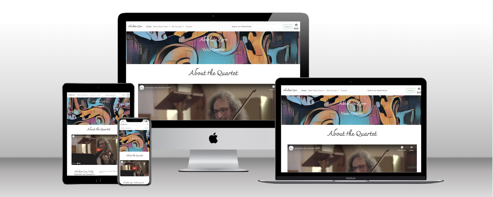

# Milestone Project 4 - Absolute Zero Viola Quartet

## Purpose

This website was created for Code Institue's Milestone Project 4 assignment. The purpose of the project is to demonstrate an understanding of full stack web development with the creating of a Django app, which will include fully automated e-commerce functioniality. A full list of technologies used can be found in the technologies section fo this readme.

The live website can be found [here](https://absolute-zero-viola-quartet-0449ad0ad766.herokuapp.com/)

## Absolute Zero Viola Quartet Responsive Website

For this project I have chosen to understake a full redesign of Absolute Zero Viola Quartet's website. Their current website is built with wordpress by one of the band memebers who is not a web developer.

This project will cater to two distinct sets of users needs.

1) Sheetmusic Store:
* To sell their viola quartet arrangements via a fully automated e-commerce store.
2) Web presence for the band:
* Advertise upcoming concerts.
* Promote the band to promoters and concert organisers.
* Information about the band and its musicians.

## Web store

Absolute Zero Viola Quartet create their own arrangements of popular classical pieces. Their current website has a functioning sheet music store where users may select and buy sheet music, with one major issue: once paid for users must wait for a member of the band to email their purchases to them in the form of a pdf file. My redesign will generally improve the webstore user experience and add one key feature:

Once users have paid for an arragement it will be available for them to download. If a user loses the pdf, they may log back in to the website and download again.

The webstore was largely created by following code institutes 'Boutique Ado' project. This was modfied to suit the needs of Absolute Zero.

## Web presence for the band

# User Experience Design

## User Stories

USER STORIES GO HERE

# Structure

## Main Navigation (header)

A nav bar has been created in base.html. All other html.files are extended from this base. Therefore the main nav is consistent and available on all pages and at all times. If/ else statements are used to show and hide links that require login dependant if a user is logged in or out. 

Simple link text is provided for the user so that may understand on the first pass the purpose of all links. Dropdown menus are provided for the sheetmusic store and user profile. If a user is logged out an option is displayed for them to login or create an account.

The main navigation helps fulfil user stories:
* "As a first time user I want to immediately know the purpose of the site so that I can understand it’s purpose" 
* "As a first time user I want to be able to easily navigate the site so that I can easily explore."

## Footer

In a similar manner to the main nav a simple footer has been designed. This has been added since wireframes were designed. Absolute Zero only have one well followed facebook page so it seemed appropriate to feature that as the sole link in the footer. Users who wish to find out more via the facebook group may follow this link. 

This helps fulfil user stories:
* "returning user I want to be able to easily view social media accounts that the band own so that I can learn more about them and view more content beyond the website"

## Band App

An app for all content for the band itself: info, videos, concert listings, biographies.

### Index Page (Home)

On loading the home page users are presented with a banner consisting of a graphic of viola scrolls, the bands name and ensemble type. Immidately below this is an iframe with a embedded youtube video that users may play to know what the band looks and sounds like. Below the video is a sub heading informing users of when the band was formed and a paragraph with some initial information on the band. 

This fulfils users stores:

* "As a first time user I want to immediately know the purpose of the site so that I can understand it’s purpose" 
* "As a concert organisier/ fixer I want To find out what the band has to offer and know exactly what they sound and look like so that I can decide wether they fit the concert/ event/ festival that I" am planning

The user is presented with a some short text about the origin of the and button leading them to the 'about' page where they may learn more about the band and its members. 

The user is also presented with a video of the band performing one of their own arrangements for viola quartet. 

This fulfils user story:
* "As a first time user I want to be able to learn more about the band so that I can understand who they are and what the band is."

Below is another sub heading before bootstrap cards present the user with a list of the bands upcoming performances. Each card is populated via the database and contains basic information on each performance: date, time, venue, city/towm and a ticket link. As most venue handle ticket sales internally or via an external ticket source a link is provided to the user. 

This fulfils user stories:
* "As a returning user I want to see if any new concert dates have been added so that I can plan to see the band live."
* "As a returning user I want to see if any new information on the band has been added so that I can keep up to date as a fan on the band."
* "As a concert organisier/ fixer I want To find out what the band has to offer and know exactly what they sound and look like so that I can decide wether they fit the concert/ event/ festival that I" am planning

### About page

A simple page which provides a space for more in depth information on the band, aswell as an image and personal biography of each member. Member information is populated by the database and can only be modified via the django admin panel.

This fulfils user stories:
* As a first time user I want to be able to learn more about the band so that In can understand who they are and what the band is.
* "As a returning user I want to see if any new information on the band has been added so that I can keep up to date as a fan on the band."

### Band app for superusers

Superusers, defined as a band manager have access to spesific functionality within the band app to add, delete and update concert listings. Superusers are provided a button at the bottom of the page. Think links to the 'add_concert' page where the superuser may fill out the form provided to add a new concert. 

In addition superusers may edit or delete concert listings via the concert listing bootstrap cards themselves. Appropriately colored 'Edit' and 'Delete' buttons are provided so the superuser may easily edit or delete concert listings. The edit button links to a similar form to the 'add_concert' form which is pre populated with the data for the concert they have selected to edit. The delete link is protected with a modal which warns the superuser on click that deleting the concert is pernament. 

This functionality fulfils user stories:
* "As a band manager I want	to be able to add our concert dates to our listings so that I can advertise our performances."
* "As a band manager I want to be able to update any current concert listings to that I can keep the information up to date."
* "As a band manager I want to be able to delete any concert listing so that I can remove concerts from the listings which have been cancelled."
* "As a band manager I want to be able to point users to external sites within concert listings so that I can provide a link to a site where they are able to buy a ticket/ find out more information on our performances."

Currently superuser must input date/time data in format: 'yyyy-mm-dd mm:hh'. Limitations in development time means that a datepicker will need to wait until the next release. Currently only superusers may add or edit concerts, this is likely only one person so this information can be passed to them.

## sendemail app

An app to provide users with a simple contact form to send a message or enquiry. Accessible at all times via the main nav bar. The contact form has been designed with a general purpose in mind so all users who wish to send a message can use it, wether they are making a performance enquiry or enquiring about an order or have another question. 

As an page which requires more styling that other purely functional forms, I chose to use a similar styling to my milestone-project-1 contact form. An image of one of the band members was used as a background to entice users to send an enquiry.

The users name, email address a message are required by the form. The user may also leave their contact number in an optional field. 

This fulfils user stories:
* "As a band manager I want to be able to	receive emails from potential bookers or customers who have questions so that i can	get performance opportunities for the band have receive emails from customers."
* "As a first time user I want to be able send a message to the band so that I can see if they are available for my event/ want to collaborate/ to answer my question about the store.

## sheetmusic app

An app to display the sheetmusic store. Sheetmusic products are displayed with bootstrap cards. Images are the first page of the score which is large enough for users to get a solid idea of the prouduct. 

The sheetmusic for users consists of two main pages:

### all_sheetmusic.html

Where all sheetmusic is displayed by default, the user is also provided search and filter functionality.

Bootstrap cards:

Sheetmusic items are displayed via bootstrap cards. An image of the first page of the sheetmusics store is provided giving a clear indication (to a trained musician) of the ensemble type. The sheetmusics name and composer are provided, along with the price. Users may click the image to proceed to the selected sheetmusics full details.

This fulfils user stories:
* "As a shopper I want to browse the sheet music store so that I can browse sheetmusic."
* "As a shopper I want to be able to find out more about a particular title so that I can decide if I want to buy it."

Filtering and search:

The user is provided dropdown list in the nav bar where they may select pre-set filters to filter the sheetmusic by ensemble type. Users are also provided a search box in the nav bar where they may search for a spesific title, or by composer. Filter and search results are displayed in similar bootstrap cards on this page. The user is also provided with a h2 heading displaying their search criteria. 

This fulfils user stories:

* As a shopper I want to be able to search the sheet music store to see if the store caters to a title that I am looking for.
* As shopper I want to be able to	filter music by type so that I can find sheet music for my specific ensemble (duo, trio, quartet, ensemble).

### sheetmusic_detail.html

Where a sheetmusic items full detail is displayed: Name (title), Composer, Arranger, Category, description and price. 

The user is provided with an option for user to add the sheetmusic to their basket. 

This fulfils user stories:
* "As a shopper I want	to be able to find out more about a particular title so that I can decide if I want to buy it."
* "As a shopper I want to be able to add sheetmusic to the shopping basket so that I can keep browsing the store, then make a purchase of more than one."

### sheetmusic app for superusers

Superusers, those defined as store managers have access to additional store owner functionality.

Adding Sheetmusic. Store managers may add new sheetmusic items to the store via a link provided under the 'My Account' tab on the nav bar. On clicking 'add sheetmusic' they are taken to add.sheetmusic.html. Here the superuser is provided with a form where they may add all the required information to set up a new sheetmusic item. The superuser must ensure that the correct PDF file is added via this form as this is what they shopper will receive on download after purchase. 

This fulfils user story:
* "As a manager of the store I want to be able to to add new arrangements to the store so that I cans sell them via the store."

Superusers may also edit and delete sheetmusic from the store. This functionality can only be accessed via the 'sheetmusic_detail' view. Superusers are provided with an appropriately colored edit link. The edit link takes superusers to a similar form to 'add_sheetmusic.html'. The form is pre populated with data from the sheetmusic item the superuser has selected.

This functionality fulfils user story:
* "As a manager of the store I want to be able to update all details of sheet music products in the store so that I can keep them up to date and correct any errors."

Superusers may also delete sheetmusic from the store. Accessed via the same location as the 'edit' function, an appropriately colored delete link is provided. When the user clicks this link, a bootstrap modal is triggered where the user may confirm deletion or go back. 

This fulfils user story:
* "As manager of the store I want to be able to delete sheet music items so that I can remove any which I no longer wish to sell."

A note on delete functionality:

This is a function that a superuser must use only if they must as deleting sheetmusic from store also removed a users ability to access and download the deleted sheetmusic from their order history. This can be commuicated to anyone with superuser credentials. Sheetmusic rarely will need to be deleted as once it is placed for sale it likely will remain on sale. If a new version or edition becomes available, superuser may use the edit function to replace the existing pdf. 

## Basket App

An app for users to add items to their basket. Users may add items to their basket by viewing the sheetmusic detial and clicking the add to basket button. 

As users browse the store they always have access to their basket total via the nav bar, on smaller screens this is one click away in the menu. Users can view a basket icon that changes color once one or more sheetmusic items are added to their basket, along with a their basket total. If no sheetmusic is in the basket the text turns black again. 

This fulfils user story:
* "As a shopper I want to know how much basket total is as i browse and add sheet music to it so that I know how much I am spending."

As users are buying a digital product, there is a hidden quantity variable on the sheetmusic_detail page always set to 1. Users may click 'add to basket' again to add a 2nd, 3rd copy and so on if they wish. Digital sheetmusic products are easy to copy and share once users have bought and downloaded. As all sheetmusic products in the store include a score and set of parts as one single PDF file, it is assumed that a quantity of 1 serves a whole band of however many instruments the sheetmusic purchased is designed for. Users may wish to purchase more copies if they intent to supply them to more than one band or ensemble. 

Sheetmusic items in the users basket are displayed via bootstrap cards. They are presented with a clear summary of the sheetmusic. Along with a quantity that they have added to their basket.

Once a user has selected the sheetmusic they wish to purchase, they can click the basket icon to proceed to the checkout.html page. Here the user is provided with a summary of their basket.

This fulfils user story:
* "As a shopper I want to be able to view items in my shopping basket so that I cn decide if I am happy with my purchase."

Users may remove items from their basket by clicking the red 'remove' link.

This fulfils user stories:
* "As a shopper I want to remove sheetmusic from my purchase so that I can decide not to buy that sheet music."

If they are happy with the basket they may proceed to checkout via the relevant link.

This begins the process of fulfiling user story:
* "As a shopper i want to Mbe able to make a secure payment online	so that I can buy the sheetmusic selected in my basket"

## Checkout app

As user must download their purchased sheetmusic after purchase, the checkout app is protected by the django @require_login decorator. This simply redirects users to the login page where they may login or create an account if they do not allready have one. Anonomous purchases would make downloading sheetmusic difficult after navigating away from their order confrimation. 

The checkout app to handles payments of sheetmusic items the user has selected. The user is brough to the 'checkout.html' page after clicking the relevant link in 'basket.html'. The user is presented with an order summary, so they may double check the order they are placing is correct. The user is also presented with a a series of forms where they may enter their :

* name, email address and contact number.
* Billing details
* Payment details

Payment card detials are handled via stripe. 

This fulfils user story:
* "As a shopper I want to make a secure payment online	so that I can buy the sheetmusic selected in my basket"

Users are provided with a check-box where they may choose to save their billing details. This allows users to more quickly check out the next time they make a purchase.

This fulfils user story:
* "As a shopper I want to be able to save my billing details so that I can check out more quickly next time."

Once the user makes payment they are taken to the 'checkout_success.html' where they may view their order summary. The order summary contains links where the user may instantly download their sheetmusic. 

This fulfils user story:
* "As a shopper	I want to have instant access to any pdf which I purchase so that I can view the product I have bought immediately after purchase."

If an issue arises with sheetmusic a store owner may need to contact the user so the user may provide this via an optional field.

This fulfuls user story:
* "As a manager of the store I want to be able to save a customers contact details	so that I can contact them if there is an error with an order or sheet music"

A note on sheetmusic pdfs for CI submission: after setting up static file hosting on cloudinary, I discovered that their free plan does not allow for downloading of pdf files. It does however allow download of image files. So for submission all files in the sheetmusic 'pdf_file' field have been replaced with the same image used for the sheetmusic image. At this time cloudinary's paid subscrition is too expensive to for me to justify. The functionality remains the same.

## Profiles app

An app where users may perform two main functions.

1. Add or update their billing information. This is done via form generated by crispyforms. An save or update button is provided so the user may click when they are completed the form.
    This fulfils user stories:
    * As a shopper I want to save my billing details so that I can check out more quickly next time
    * As a shopper	I want to be able to update my billing details so that I can change them when needed.
2. View past order history. The user is provided with a list of their previous orders along with a breif summary. The user may select any order via the link provided in their unique order number to proceed to any previous order summary. This is achieved via the same template user for "checkout_success". A user may return to any previous order. In each order summary they may access their purchased sheetmusic pdf files.
    This fulfils user stories:
    * As a shopper I want to be able to review previous orders so that I know when and what I have purchased.
    * As a shopper I want to be able to return to previous sheetmusic that I have bought so that I can download them again. 
    

## Allauth

To handle user accounts, logging in and out. Django allauth was used. 

All auth has a series of html templates with pre builtfunctionality. There were modifed to be in keeping of the style of the site. As there are many templates associated with allauth. Some styling was added on an ongoing basis. Some testing screenshots show unstyled buttons. These were corrected as I went, rather than pushing to github and deploying on heroku again.

This helps fulfil user story:
As a first time user I want to be able to easily navigate the site so that I can easily explore.

Allauth has two main uses:
1. To allow users to create accounts and login to perform all sheetmusic store functionalty.
    This helps fulfil use stories:
    * As a shopper I want to easily sign up or login so that I can make a purchase
    * As a shopper I want to have instant access to any pdf which I purchase so that I can view the product i have bought immediately after purchase.
    * As a shopper I want to review previous orders so that I know when and what I have purchased.
    * As a shopper I want to return to previous titles that I have bought so that I can download them again. 
2. To allow superusers extra functionality where they may add, edit, delete sheetmusic and concert listings.
    This helps fulfil all user stories that deal with these functions. 

# Database Schema

ElephantSql tiny turtle plan was used to host the database. Full database schema can be viewed below.

user: for user accounts

Concert: for concert details. Only basic details were required. No further link to more detailed concert were needed. Ticket link intentionally links users to external sites. CRUD functionality via views created.

Enquiry: an unused database schema. sendemail app replaced this databases intended function as enquiries did not need to be saved at this stage. Model left in place in case deletion caused unforseen errors.

Band_member: Simply used to store band memeber name, image and biog. More efficient than hard coding. Access only via django admin.

sheetmusic: for sheetmusic store items.

# Wireframes

Wireframes can be found [here](https://github.com/siondawson/milestone-project-4/tree/main/wireframes).

Most pages have wireframes created for mobile and desktop and can be viewed via the link above.

Wireframes were not created for pages that are forms. Crispy forms was used to automatcially generate form fields. Each form was set to an appropiate width to suit the screen size and users expectation.

The main nav end design differs slighly from the wireframe. Dropdown menus were added rather than a single menu link for ease of navigation and quick filtering of sheetmusic. The about link has been removed and is only accessible for users in the main body of the page if they wish to learn more. 

Footer was not featured in wireframes. 

Nav appears in index wireframe.

# Testing

Full testing can be found here.

## Issues found during testing.

One major issue found during testing:
* Duplicate orders being created in database. Assumed to be an issue with web handler. Many print statements added to log as much as possible to try an discover the source of the problem. Many, many hours spent which we're planned to be spent on adding some additional features. The problem was eventually discovered to be an HTML template variable 'client_secret' on checkout.html with only {} when it required {{}}.

## Validation

Vadlidation screeshots can be found in this projects repository.

### HTML Validation

All html ran through [W3C validator with no errors found](https://validator.w3.org/#validate_by_input). HTML was input by right click > view page source > copy > paste into direct input.

HTML validated in logged in and logged out states.

### CSS Validation

CSS ran through [W3C Validator](https://jigsaw.w3.org/css-validator/) with no errors found.

### Python Linter

All python files were checked with the code institue python linter. Three line too long issues were left in place in webhook_handler.py for personal ease of reading as lines were only 1 character too long.

All other other files pass linting with no issues. Screen shots are available in this projects repository.

## Challenges during developement

This project has had a series of difficulties to overcome, partially as it's sheer size has been much larger in terms of volume of files. Throughout the developmenet process many errors were encountered with many arising from confliting dependencies. With a heavy reliance on boutique ado to guide the overall structure and flow of the sheetmusic store, beginning the development process with better knowledge of how dependences such as crispy forms, psycopg2 and django countries interact with one another would been benefitial. Many hours of development time were spent with the help of CI tutors finding a suitable balance of dependancies. 

In my midpoint meeting my mentor advised me that whenever she begins a new django app she begins with a pip install of all the latest dependencies, ensuring they are supported and dont conflict. 

Another challenge was development environment. This project was created with code institues full template designed for codeanywhere. At the start of a period earmarked for development time codeanywhere went down with no knowledge of when it would go back up, therefore the project was moved to gitpod on the advice of the tutors.

Gitpod was a big improvement, however caused a database issue that was resolved by setting the project up locally in vscode and deleting files associated with codeanywhere. 

So that the I could use tutor support effectively the project was eventually moved back to gitpod which has worked perfectly since. 

Static files are hosted at Cloundinary. Hosting via AWS was attempted but encountered problems with dependencies. My mentor suggested using cloudinary.

Cloudinary does not allow for use of pdf files under it's free plan. Therefore for assesment purposes pdf files were replaced with the same images used for sheetmusic product. These open in a new tab. If they we're pdf files an option to download is visible within the viewer. This would only work on the local version of the site. 

## Features left to implement

With much development time taken up my major challanges in getting webstore base functionality working some features remain to code and include:

* A date/time picker for adding and editing concerts: currently date time data must be entered in the spesific format: 'yyyy-mm-dd mm:hh'. A date picker would improve the experience for superusers adding concerts. 
    * A quick, imperfect solution was added in final stages before submission. Placeholder text and labels were added to add and edit concert forms. Users may enter datetime data in the format spesified, however django alters this when users to go edit concerts to an 'american' date format. Users may still enter data as prompted by the label. This is not an ideal solution but is better than nothing.
    * Also in the final stages a check was added so that concert listings will remove any concerts that are in the past. This helps improves the user experience by not advertising concerts that have passed.

## Deployment
This project was created using the code institute template.

## Version Control
This project was created using Visual Studio Code editor and pushed to 'milestone-project-3', a remote repository in github.

Throughout the project these commands were used to save work and push changes to github via the command line terminal.

1. Type: git add .
* This command adds files to the staging area before committing.
2. Type: git commit -m "a message goes in here explaining what chanes were made"
* This command commits changes to the local repository
3. Type: git push
* This command commits all changes to the remote GitHub repository.

## Clone the repository to your machine
1. Navigate to the github repository
2. Click on the code drop down button.
3. Click HTTPS
4. Copy repository link
4. Open your IDE (git must be installed)
5. Type git clone (copied git url) into the terminal.
6. The project will now have been cloned on your machine.

### Heroku
This project is deployed via Heroku. Heroku is connected to this projects github repository. With every push the deployed Heroku app is updated.

### Database (Elephant SQL)
The deployed website is connected to a database hosted by Elephant SQL.

#### Project deployed via Heroku with the following steps.
1. Ensure requrements.txt is up to date wuth correct versions.
2. Create Procfile.
3. Create new file in root directory.
4. Name it "Procfile"
5. Enter following command in the file: "web: gunicorn absolute_zero.wsgi:application"
6. Commit new files to github
7. Navigate to Heroku
8. Click create new app
9. Name the app (absolute-zero-viola-quartet)
10. Enter confirg vars.
11. Disable collection of static files with COLLECTSTATIC: 1
12. Navigate to Heroku deploy tab
13. Click connect to github
14. Search for correct repository
15. Connect
16. Click Deploy
17. Process complete

#### Cloudinary 

Static files are hosted by cloudinary. 

## Credits
The code content of this software was createe by Sion Dawson

## Media

The video shown on the home page of the site was created by me on request of Absolute Zero Viola Quartet. A selection of 'screen-grabs' have been taken from this video to serve as website images. They are used on the about page member biogs and on the contact page. 

All other images were provided by Ross Cohen of Absolute Zero Violas.

## sheetmusic store images and text

The small selection of sheetmusic items added to the store were copied direclly from Absolute Zero Viola Quartet's existing store. Images, descriptions and prices.

## About text

Text was copied and sometimes adapted from Absolute Zero Viola Quartet's existing website. 

Biography of Philip Heyman was provided by him.

## Acknowledgement

Thankyou to my tutor Daisy McGirr for her help and guidance in this project. Thanks also to my wife Samantha (code institute alumni) for helping me overcome problems and discussing ideas.

